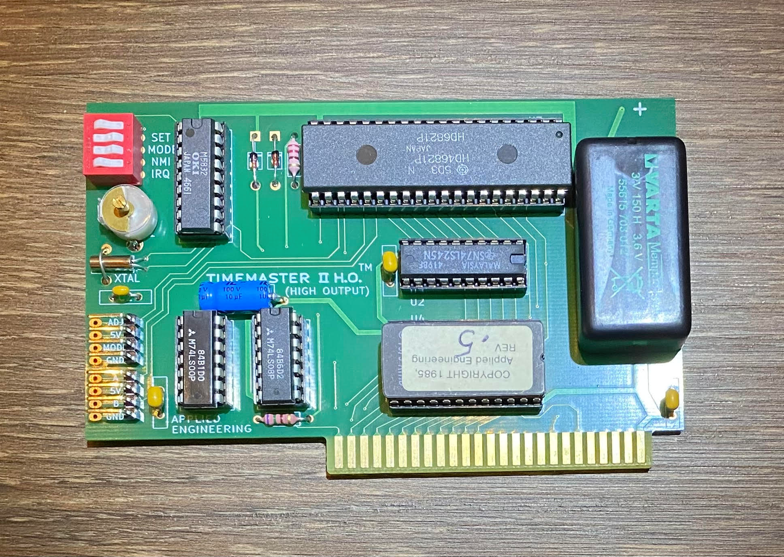

# PCB for the TimeMaster II H.O. board from Applied Engineering, Inc.

I recently acquired an Apple IIe with a TimeMaster II H.O. board in it, but the on-board battery (a VARTA) had leaked all over it, rendering the board unsalvageable.

However, because it's a simple 2-layer board, it was fairly straightforward to reverse-engineer it, so I brushed up on my KiCAD and came up with this. The schematic is not great, because my main intent here was just to get something going in order to be able to route the PCB, but everything works (on the first try even!).

The part numbers are all in the BOM (Tools->Generate Bill of Materials... in KiCAD) and everything except the ROM chip and the peripheral IC is available from either Digikey or Mouser. The board works great, I've been running it for a year now with no problems.

If you want to build this from scratch, you'll need the board, the parts from the BOM, the HD6821 peripheral chip (good luck), and a ROM chip you can burn with the code from here:
https://ae.applearchives.com/all_apple_iis/time_master_ii_ho/

I made an effort to try and keep the original look of the board as best I could. Enjoy!

